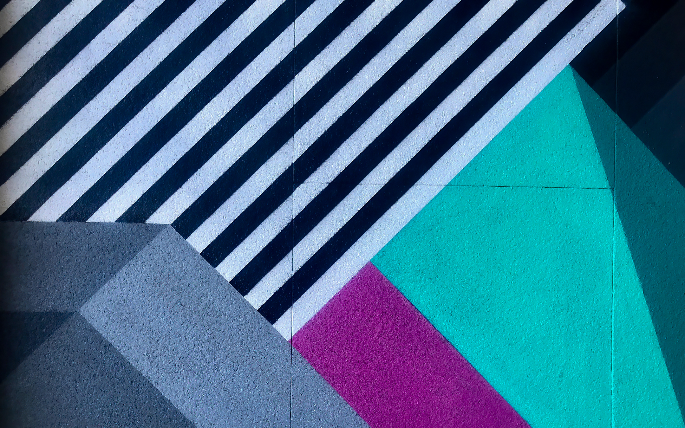
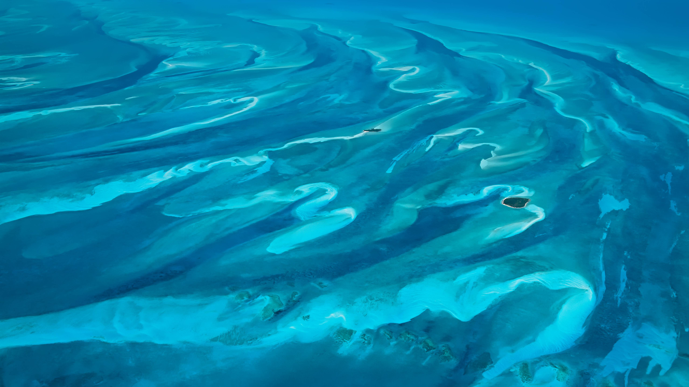
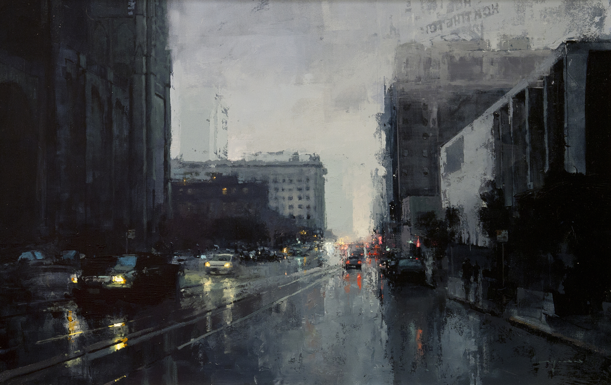
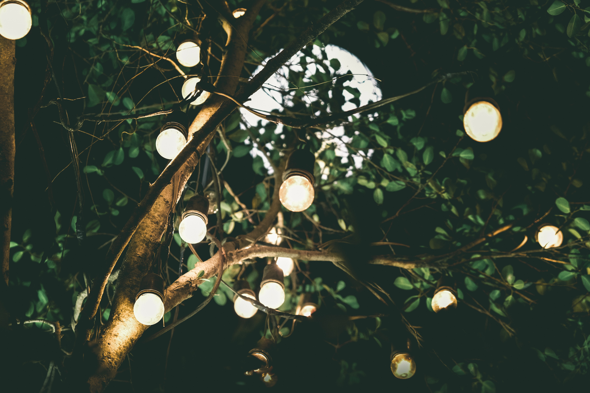
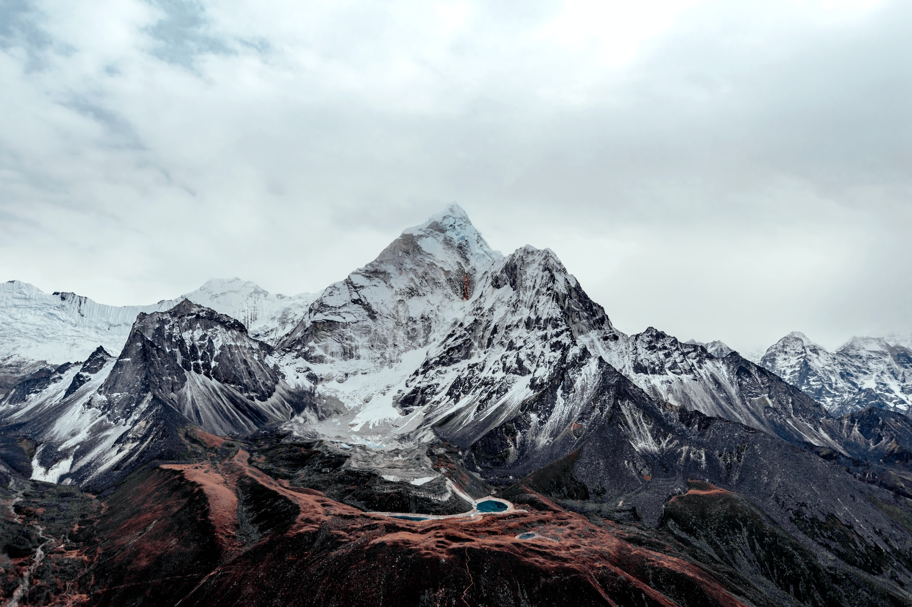
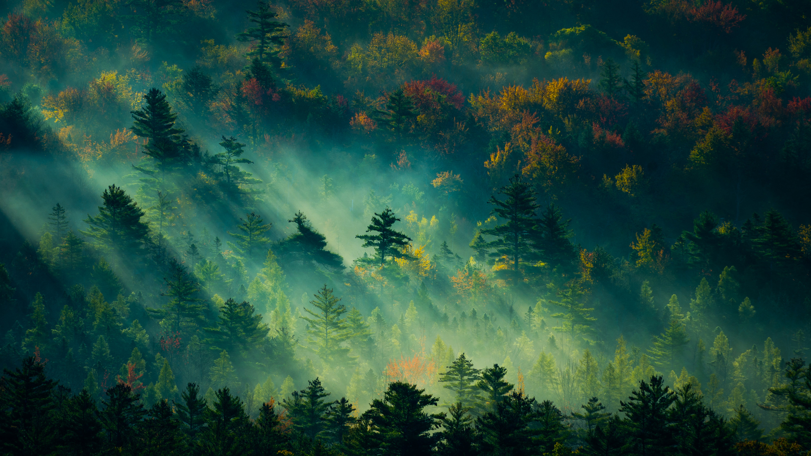
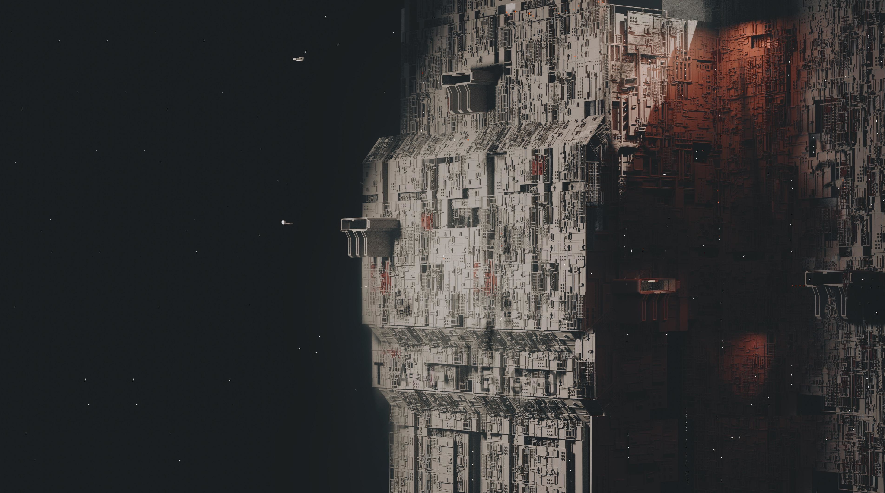
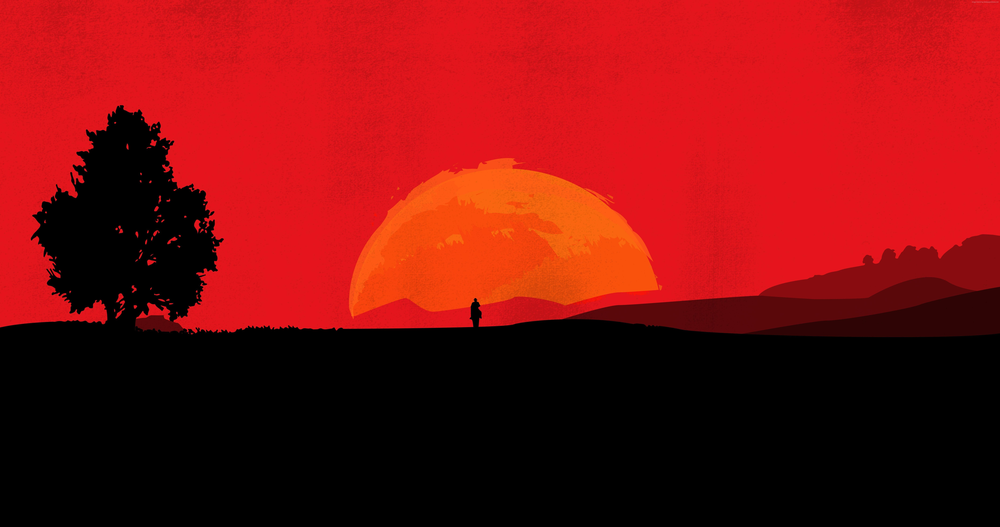

#  Wallpapers

A collection of wallpapers that I have accumulated from a several of repositories. All images are organized into categories and renamed for convinience. If you need to flatten the images into a single collection, you may run the script `flatten.sh` located inside the `scripts` directory.

## Showcase

### Abstract

### Aerial

### Anime

### Architecture

### City

### Digital

### Lightbulb

### Mountains

### Movies

### Nature

### Road

### Space

### Tech

### Video Games

## Ownership

Because I downloaded most of these from public repositories, I have no way of knowing if there is a copyright on these images. If you find an image hosted in this repository that is yours and of limited use, please let me know and I shall remove it immedietely.
